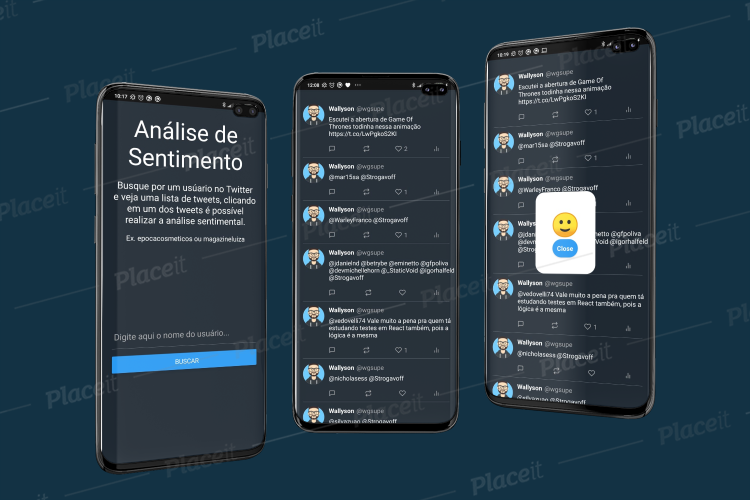

<h1 align="center">
    <a href="https://www.epocacosmeticos.com.br/" target="_blank">
      
    </a>
</h1>

<h4 align="center">
  🚀 Análise Sentimental
</h4>

<p align="center">
  

  

  <a href="https://github.com/WallysonGalvao/epoca-challenge/commits/master">
    
  </a>

  <a href="https://github.com/WallysonGalvao/epoca-challenge/issues">
    
  </a>

  
</p>

<p align="center">
  <a href="#-projeto">Projeto</a>&nbsp;&nbsp;&nbsp;|&nbsp;&nbsp;&nbsp;
  <a href="#-layout">Layout</a>&nbsp;&nbsp;&nbsp;|&nbsp;&nbsp;&nbsp;
  <a href="#rocket-tecnologias">Tecnologias</a>&nbsp;&nbsp;&nbsp;|&nbsp;&nbsp;&nbsp;
  <a href="#rocket-executando">Executando</a>&nbsp;&nbsp;&nbsp;|&nbsp;&nbsp;&nbsp;
  <a href="#memo-licença">Licença</a>
</p>
<br>

## 💻 Projeto

Esse desafio faz parte do processo seletivo da **[Época Cosméticos](https://www.epocacosmeticos.com.br/)**, com foco em React Native. Trata-se de um aplicativo de análise sentimental utilizando a API do Google Natural Language.

## 🎨 Layout

<p align="center">
    
</p>

## :rocket: Tecnologias

Esse projeto foi desenvolvido com as seguintes tecnologias:

- [Typescript](https://www.typescriptlang.org/)
- [React Native](https://reactnative.dev/)
- [Twitter API](https://developer.twitter.com/en)
- [Google Natural Language API](https://cloud.google.com/natural-language)
- [Styled-components](https://www.styled-components.com/)

\* Para mais detalhes, veja o <kbd>[package.json](./package.json)</kbd>

## :notebook: Executando

### Pré-requisitos

É necessário que um simulador android/ios esteja rodando, ou um aparelho fisico.

<em>Obs: Não testei no iOS por motivos de: não tenho Mac.</em>

```bash
# Clone este repositório
$ git clone https://github.com/WallysonGalvao/epoca-challenge.git

# Acesse a pasta do projeto no seu terminal/cmd
$ cd epoca-challenge

# Instale as dependências
$ yarn install

# Execute a aplicação
$ yarn android ou yarn ios
```

Se desejar, pode rodar os testes do projeto:

```bash
$ yarn test
```

---

Feito com horas em frente ao :computer: por [Wallyson Galvão](https://www.linkedin.com/in/wallyson-galvao/)
